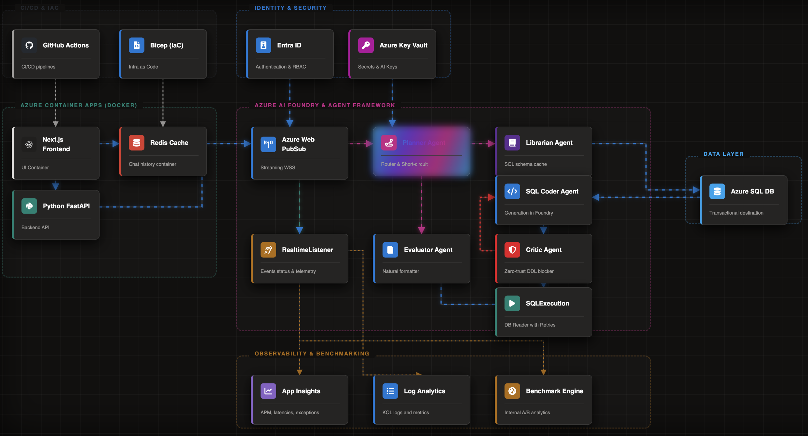

[Versión español](./README.md)
# Nexus Insight

### The key to addressing the problem and implementing the solution.

**Nexus Insight** the analytical AI solution that bridges the gap between natural language ambiguity and the rigidity of relational databases (Text-to-SQL). Unlike traditional monolithic models, it utilizes the **MAC-SQL paradigm**—a specialized multi-agent architecture that ensures security, cost reduction, and technical accuracy.

---

### ✨ Innovative Architecture: The MAC-SQL Paradigm
Rather than relying on a single omnipotent prompt, **Nexus Insight** orchestrates a specialized team of intelligent operational agents. This methodology is theoretically grounded in the **[MAC-SQL Framework (arXiv:2312.11242)](https://arxiv.org/abs/2312.11242)**, which divides the cognitive load and dynamically collaborates to overcome the context limits and hallucination obstacles inherent in monolithic models. The system distributes the cognitive load across four operational agents to optimize performance:

* **Planner:** Acts as a smart router to bypass unnecessary processing for non-SQL-related queries.
* **Librarian:** Filters relevant table schemas and utilizes a Redis cache (300s TTL) to minimize latency.
* **Critic & Executor:** A "Zero-Trust" security firewall that blocks dangerous commands (DDL/DML) and performs automatic syntax error correction.
* **Evaluator:** Translates rigid tabular data into polished, executive-ready answers.

### 📈 Results and Benchmarking (Data-Driven Evidence)
Implementation has shown significant improvements over standard models:
* **Time Efficiency:** A **50.5% reduction** in P50 user wait times, powered by the *Planner’s* short-circuit routing.
* **Cost Optimization:** A **62.5% reduction** in token and computational costs by replacing expensive context windows with ultra-fast memory reads (Redis).

### 🛡️ Security and Governance (Enterprise-Ready)
The project fundamentally adheres to Microsoft’s Responsible AI principles:
* **Native Security:** Integrated with **Azure AI Content Safety** to neutralize prompt injections and **Entra ID** for identity management.
* **Human-In-The-Loop (HITL):** An architecture that requires explicit, logged human consent before dispatching critical insights.
* **Transparency:** Real-time streaming of agent decision-making via **Azure Web PubSub**.

### 🌳 Technology ecosystem
An Azure-native solution (AI Foundry, Container Apps, SQL, Key Vault) deployed via Infrastructure as Code (Bicep) and CI/CD.

### 🧭 Roadmap 
* **The inmediate Road Ahead** include:
    - **Microsoft Teams** Adaptive Cards integration for autonomous approvals.
    - **Model Context Protocol (MCP)** to natively generate Power BI visualizations and executive PDF summaries.

### 🏢 Architecture  

   

### Additional Resources

- [Nexus Insight - Live Demo](https://nip-app-chat-zngovxusmkn3y.azurewebsites.net/)
- [Nexus Insight - Slides](https://emilio17mc.github.io/nexus-insight-planning/)
- [Alternative Link for Video](https://drive.google.com/file/d/1feI2RUFpmW7T0pD-Jj0l9zjnn_deZ7oS/view)
